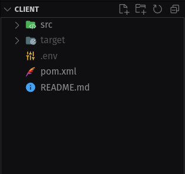

# 🖥️ Client

This is the client module of the Library-IDS-2023 project, this module is in charge to request services to any of the servers.

There are several ways to use this module, in this file you will find a little walkthrough that explains how to set up the module, compile and the usage of it.

## 📚 Dependencies

* [dotenv-java](https://github.com/cdimascio/dotenv-java)
* [jeromq](https://zeromq.org/)
* [junit](https://junit.org/junit5/)
* [maven-assembly-plugin](https://maven.apache.org/plugins/maven-assembly-plugin/)

## ℹ️ Environment Variables

To run this project, you will need to add the following environment variables to your .env file

`IP_SERVER_A` IP address of the server A.

`PORT_SERVER_A` Number of the port of the server A.

`IP_SERVER_B` IP address of the server B.

`PORT_SERVER_B` Number of the port of the server B.

`TIMEOUT` Time to wait for a response to the server, this value is in milliseconds.

`MAX_RETRIES` Number of attempts to resend the request to one of the two servers.

>The location of the .env file should be the root of the client folder.



## 🏗️ Compilation

Once the repository is cloned, should get into de client folder

__Bash__
```bash
  cd Library-IDS-2023/client
```

__cmd__
```bash
  dir Library-IDS-2023/client
```

Now just compile and export the client using maven

```bash
  mvn clean compile assembly:single
```

The previous line will compile and package the client with all his dependencies into a `.jar` file inside the target folder. 

## 🛫 Run Locally

Once it's already compiled go into the target folder

__Bash__
```bash
  cd Library-IDS-2023/client/target
```

__cmd__
```bash
  dir Library-IDS-2023/client/target
```

Here you should see a file named `client-library-1.0-jar-with-dependencies.jar`, this is the file you must run using `Java`.

Start the client

```bash
  java -jar client-library-1.0-jar-with-dependencies.jar
```


## ✏️ Usage

There is three ways to use the client through a guided CLI or just using flags with parameters. 

If there is no flags the client will go into the guided CLI.

### 🎏 Flags

`-s` The service you wanna request to the server (Borrow, Renewal, or Return).

`--isbn` The __ISBN__ of the book you want to apply the service.

`-c` The campus where the service needs to apply (1 or 2).

`-f` A file path to request various services.


## 🃏 Examples

Requesting a Borrow service to the campus 1 of the library.

```bash
  java -jar client-library-1.0-jar-with-dependencies.jar -s Borrow --isbn A2L3K4I5 -c 1
```

Using a file to request various services at once.
```bash
  java -jar client-library-1.0-jar-with-dependencies.jar -f path/to/my/file.txt
```
> If you are going to use a file, the path is relative to the .jar file, so if the file is on the root of the client folder an example path will be ../myFile.txt


## 📝 File Format

The file must be a `.txt` file, and the format of the file must be like this:

```
  Borrow A2L3K4I5 1
  Renewal A2L3K4I5 1
  Return A2L3K4I5 1
  ...
```
