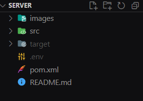
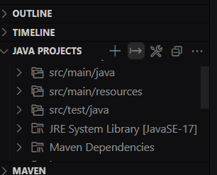
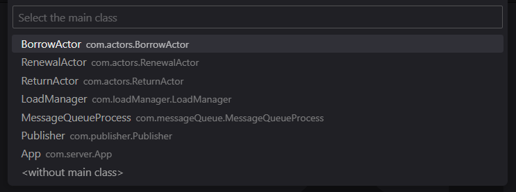

# ⚙️ Server

This is the server module of the Library-IDS-2023 project, this module is in charge to reply to the clients. This module is divided in 3 sub-modules (Load Manager, Publisher and Actors/Subscribers).

The objective of the server is to apply several patterns of communication in distributed systems, in the project was applied Request/Reply pattern and Publisher/Subscriber pattern, must also be resilient to failures.

Finally it applies a data base replication (bidirectional), the data base used in this project is [MySQL](https://www.mysql.com/).


## 📚 Dependencies

- [dotenv-java](https://github.com/cdimascio/dotenv-java)
- [slf4j](https://www.slf4j.org/)
- [logback](https://logback.qos.ch/)
- [Hibernate](https://hibernate.org/)
- [jeromq](https://zeromq.org/)
- [Jakarta Persistence](https://github.com/javaee/jpa-spec)
- [mysql-connector-j](https://github.com/mysql/mysql-connector-j)
- [maven-assembly-plugin](https://maven.apache.org/plugins/maven-assembly-plugin/)
- [junit](https://junit.org/junit5/)

## ℹ️ Environment Variables

To run this project, you will need to add the following environment variables to your .env file

`LOAD_MANAGER_JAR` Path to the loadManager .jar file.
`PUBLISHER_JAR` Path to the loadManager .jar file.
`QUEUE_JAR` Path to the queue .jar file.
`BORROW_ACTOR_JAR` Path to the borrowActor .jar file.
`RENEWAL_ACTOR_JAR` Path to the renwalActor .jar file.
`RETURN_ACTOR_JAR` Path to the returnActor .jar file.

`LOAD_MANAGER_TO_ACTOR_REQUEST_PORT` Comunication port between the load manager and the borrow actor.

`LOAD_MANAGER_TO_ACTOR_REQUEST_IP` IP to the load manager make the request to the borrow actor.

`ACTOR_TO_LOAD_MANAGER_REPLY_PORT` Comunication port between the load manager and the borrow actor.

`ACTOR_TO_LOAD_MANAGER_REPLY_IP` IP to the actor made the response to the load manager.

`LOAD_MANAGER_REPLY_PORT` Comunication port between the load manager and the borrow actor.

`PUSH_FROM_LOAD_MANAGER_TO_QUEUE_PORT` Comunication port between the load manager and the message queue, the load manager will push messages to the message queue.

`PUSH_FROM_LOAD_MANAGER_TO_QUEUE_IP` IP to message queue.

`PULL_FROM_LOAD_MANAGER_TO_QUEUE_PORT` Comunication port between the load manager and the borrow actor.

`PULL_FROM_LOAD_MANAGER_TO_QUEUE_IP` IP to the load manager.

`REP_FROM_QUEUE_TO_PUB_PORT` Comunication port between the message queue to the publisher.

`REP_FROM_QUEUE_TO_PUB_IP` IP to message queue.

`REQ_FROM_PUB_TO_QUEUE_PORT` Comunication port between the queue and the publisher.

`REQ_FROM_PUB_TO_QUEUE_IP` IP to make the comunication between the pub and queue.

`PUB_SUB_PORT` Comunication port between the publisher and the subscribers.

`PUBLISHER_IP` IP from the publisher.

`RETURN_TOPIC` Name of the return topic.
`RENEWAL_TOPIC` Name of the renewal topic.
`BORROW_TOPIC` Name of the borrow topic.

`MAX_ATTEMPTS` Number of attempts to try to restart a service/process.
`DELAY` Time to wait for check if all services are running.

`TIMEOUT` Time to wait for a response to the server, this value is in milliseconds.

> The location of the .env file should be the root of the server folder.




## 🏗️ Compilation

Once the repository is cloned, should get into de server folder

**Bash**

```bash
  cd Library-IDS-2023/server
```

**cmd**

```bash
  dir Library-IDS-2023/server
```

Since several jar files with their dependencies are required, it is recommended to use our IDE for the compilation of each process required by the server.





Compile every main class in the server folder, once all are compiled and exported to .jar files only run App.jar/Server.jar 

```bash
  java -jar ./server.jar
```

The command will execute the other .jar files.