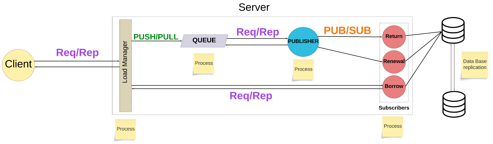

# ⚙️ Server

This is the server module of the Library-IDS-2023 project, this module is in charge to reply to the clients. This module is divided in 3 sub-modules (Load Manager, Publisher and Actors/Subscribers).

The objective of the server is to apply several patterns of communication in distributed systems, in the project was applied Request/Reply pattern and Publisher/Subscriber pattern, must also be resilient to failures.

Finally it applies a data base replication (bidirectional), the data base used in this project is [MySQL](https://www.mysql.com/).

## 📚 Dependencies

- [dotenv-java](https://github.com/cdimascio/dotenv-java)
- [slf4j](https://www.slf4j.org/)
- [logback](https://logback.qos.ch/)
- [Hibernate](https://hibernate.org/)
- [jeromq](https://zeromq.org/)
- [Jakarta Persistence](https://github.com/javaee/jpa-spec)
- [mysql-connector-j](https://github.com/mysql/mysql-connector-j)
- [maven-assembly-plugin](https://maven.apache.org/plugins/maven-assembly-plugin/)
- [junit](https://junit.org/junit5/)

## ℹ️ Environment Variables

To run this project, you will need to add the following environment variables to your .env file

`LOAD_MANAGER_REPLY_PORT` Number of the port where the load manager will binds to the client.

`PUSH_PULL_PORT` Number of the port of the communication between the load manager and the publisher.

`PULL_IP` IP address to connect to consume the pushes.

`PUB_SUB_PORT` Number of the port of where the publisher will binds and subscribers connect.

`TOPICS` Topics that the publisher will publish, separate with a ',' different topics.

`MAX_ATTEMPTS` Number of attempts to try to restart a service/process.

`DELAY` Time to wait for check if all services are running.

>The location of the .env file should be the root of the server folder.
